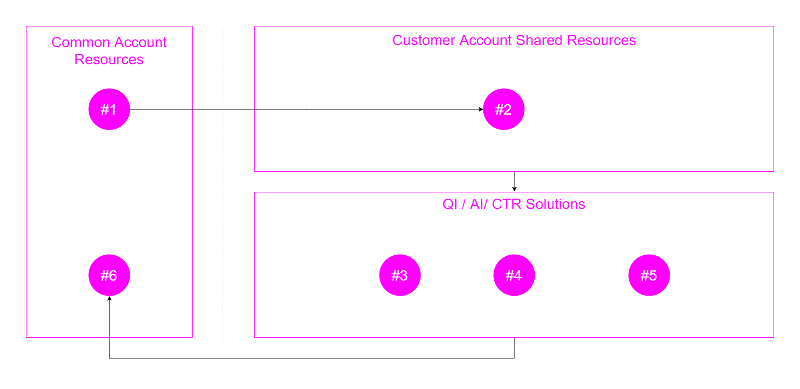

# Deploying MI

This solution is to be deployed across a COMMON account and a CUSTOMER account (e.g. tradeuk)


There are a number of inter-dependencies which means deployment needs to occur in a specific sequence.




<br>

## 0. Setting up your environment

### awsume

### aws cli

### pipenv

This solution can leverage pipenv for a consistent deployment environment.

To change to the correct environment use:

```bash
# in directory reporting/mi
pipenv shell

# first time use, install dependencies with
pipenv install
```

<br>

## 1. Set up Resources in Common Account


### 1.1  Create Common Reporting Bucket

```bash
# in common account: 
cf sync -y --context transforms/config-ccm-common-<ENV>.yml \
   modules/base-common/common-reporting-bucket.stacks
```

for example, to deploy the common reporting bucket for DEV:

```bash
cf sync -y --context transforms/config-ccm-common-dev.yml \
   modules/base-common/common-reporting-bucket.stacks
```

### 1.2 Create Athena Resources in Common Account

```bash
# in common account:
scripts/common-athena.sh ENV
```

for example, to create the athena user in common account dev:
```bash
scripts/common-athena.sh dev
```


### 1.3 Deploy Glue Partition Refresher Lambda

```bash
# in common account:
scripts/common-partitioner.sh ENV
```

for example, to deploy to common account dev:
```bash
scripts/common-paritioner.sh dev
```


<br>
<hr>

#### Steps 2 - 5 can now be completed by using the deployment script:

```bash
# in *appropriate* customer account:
scripts/deploy-to-customer.sh ENV CLIENT
```

<hr>

<br>

### Individual Steps:

## 2. Set up Shared Resources in Customer Account


### 2.1 Create Customer Reporting Bucket

```bash
# in customer account, e.g. tradeuk
cf sync -y --context transforms/config-ccm-[CLIENT]-[ENV].yml \
   modules/base-customer/customer-reporting-bucket.stacks
```

for example, to deploy the customer reporting bucket for tradeuk dev:
```bash
cf sync -y --context transforms/config-ccm-tradeuk-dev.yml \
   modules/base-customer/customer-reporting-bucket.stacks
```

### 2.2 Deploy Firehose Modder Lambda

```bash
# in customer account, e.g. tradeuk
scripts/customer-fh-modder.sh CLIENT ENV
```

for example, to deploy the customer Firehose modder in dev:
```bash
scripts/customer-fh-modder.sh tradeuk dev
```

### 2.3 Create Customer Glue Database

```bash
# in customer account, e.g. tradeuk
cf sync -y --context transforms/config-ccm-<client>-<env>.yml \
   modules/base-customer/common-db.stacks
```

for example, to deploy the customer glue db in tradeuk dev:
```bash
cf sync -y --context transforms/config-ccm-tradeuk-dev.yml \
   modules/base-customer/common-db.stacks
```

### 2.4 Deploy Customer Reporting Bucket Modder Lambda

```bash
# in customer account
scripts/customer-bucket-modder.sh CLIENT ENV
```

for example, to update for tradeuk dev:
```bash
scripts/customer-bucket-modder.sh tradeuk dev
```

### 2.5 Create Agent Event Kinesis Stream and Firehose

```bash
# in customer account, e.g. tradeuk
scripts/customer-agent-events.sh CLIENT ENV
```

for example, to create the agent event kinesis resources in tradeuk dev:
```bash
scripts/customer-agent-events.sh tradeuk dev
```


<br>

## 3. Deploy CTR Solution

Deploy the CTR solution using the cfn square cloudformation scripts.

Once deployed, run the script to update the firehose delivery stream
to transform the data to Parquet along with setting the prefixes.


### 3.1 Deploy the resources

```bash
# in customer account, e.g. tradeuk
cf sync -y --context transforms/config-ccm-<client>-<env>.yml \
   modules/base-customer/ctr-resources.stacks
```

for example, to deploy the CTR solution to tradeuk dev:
```bash
cf sync -y --context transforms/config-ccm-tradeuk-dev.yml \
   modules/base-customer/ctr-resources.stacks
```

### 3.2 Update the CTR Firehose

```bash
# in customer account
scripts/update-customer-ctr-fh.sh CLIENT ENV
```

for example, to update the firehose for tradeuk dev: 
```bash
# in customer account
scripts/update-customer-ctr-fh.sh tradeuk dev
```

<br>

## 4. Deploy Queue Interval Solution

Deploy the Queue Interval solution using the SAM deloyment script.

Once deployed, run the script to update the firehose delivery stream
to transform the data to Parquet along with setting the prefixes.  
Then run the script to update the notification policy on the reporting
bucket to trigger the QI lambda.


### 4.1 Deploy QI Lambda and Resources to Customer Account

```bash
# in customer account
scripts/customer-queue-intervals.sh CLIENT ENV
```

for example, to deploy to tradeuk dev:
```bash
scripts/customer-queue-intervals.sh tradeuk dev
```

### 4.2 Update the firehose config

```bash
# in customer account
scripts/update-customer-queue-intervals-fh.sh CLIENT ENV
```

for example, to update the firehose for tradeuk dev: 
```bash
# in customer account
scripts/update-customer-queue-intervals-fh.sh tradeuk dev
```

### 4.3 Update the Customer Bucket trigger

```bash
# in customer account
scripts/update-customer-bucket-trigger.sh CLIENT ENV queue
```

for example, to update the firehose for tradeuk dev: 
```bash
# in customer account
scripts/update-customer-bucket-trigger.sh tradeuk dev queue
```

<br>


## 5. Deploy Agent Interval Solution

Deploy the Agent Interval solution using the SAM deloyment script.

Once deployed, run the script to update the firehose delivery stream
to transform the data to Parquet along with setting the prefixes. 
Then run the script to update the notification policy on the reporting
bucket to trigger the Agent Interval lambda.


### 5.1 Deploy Agent Interval Lambda to Customer Account

```bash
# in customer account
scripts/customer-agent-intervals.sh CLIENT ENV
```

for example, to deploy to tradeuk dev:
```bash
scripts/customer-queue-intervals.sh tradeuk dev
```

### 5.2 Update the firehose config

```bash
# in customer account
scripts/update-customer-agent-intervals-fh.sh CLIENT ENV
```

for example, to update the firehose for tradeuk dev:
```bash
# in customer account
scripts/update-customer-agent-intervals-fh.sh tradeuk dev
```

### 5.3 Update the Customer Bucket trigger

```bash
# in customer account
scripts/update-customer-bucket-trigger.sh CLIENT ENV agent
```

for example, to update the firehose for tradeuk dev: 
```bash
# in customer account
scripts/update-customer-bucket-trigger.sh tradeuk dev agent
```

<br>

## 6. Update Common Reporting Bucket Permissions 


```bash
# in common account: 
cf sync -y --context transforms/config-ccm-common-<env>.yml \
   modules/base-common/reporting-bucket-policies.stacks
```

for example, to deploy to common dev:
```bash
cf sync -y --context transforms/config-ccm-common-dev.yml \
   modules/base-common/reporting-bucket-policies.stacks
```
